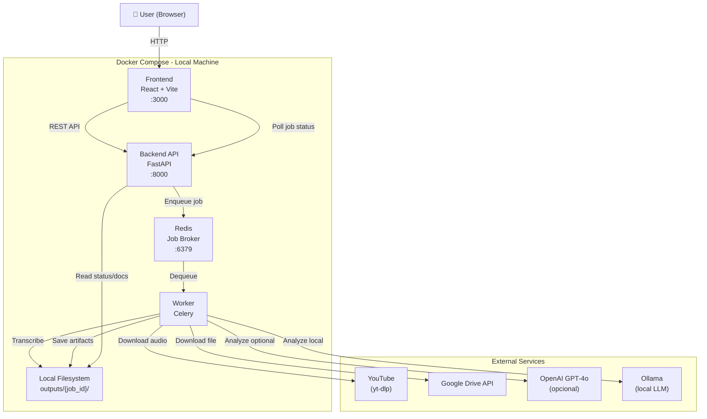
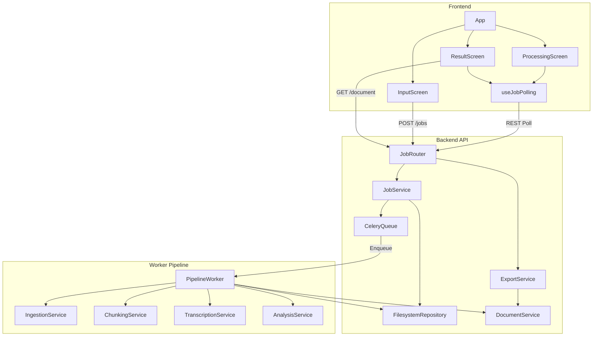
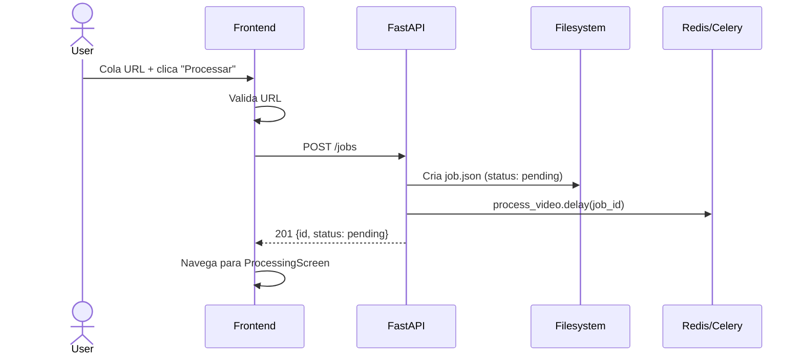
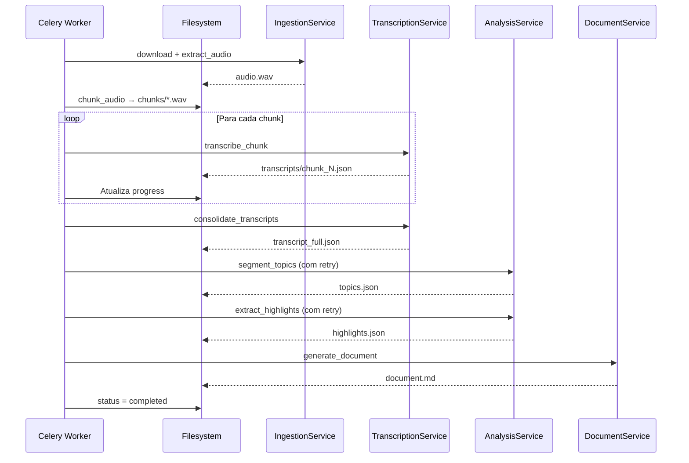
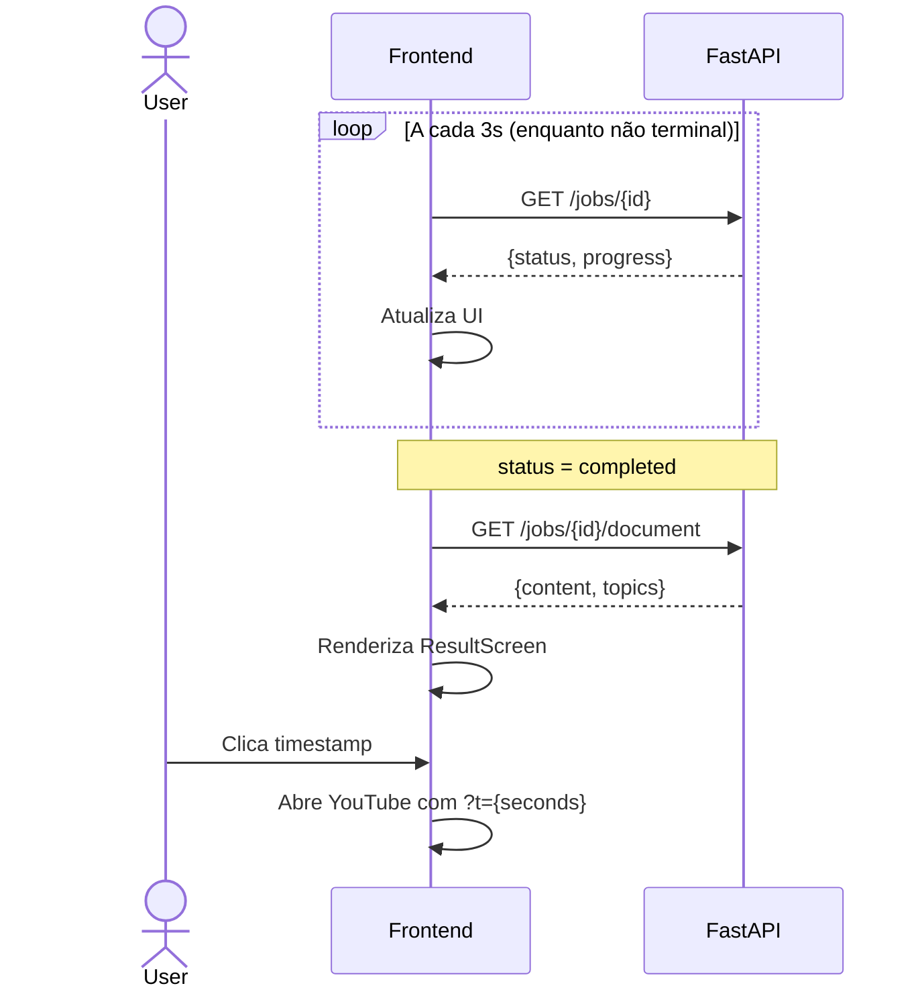

# Video Transcription & Analysis App — Fullstack Architecture Document

**Version:** 1.0
**Date:** 2026-03-24
**Author:** Aria (Architect — Synkra AIOX)

---

## Change Log

| Date | Version | Description | Author |
|------|---------|-------------|--------|
| 2026-03-24 | 1.0 | Initial fullstack architecture | Aria |

---

## 1. Introduction

This document outlines the complete fullstack architecture for the **Video Transcription & Analysis App**, including backend systems, frontend implementation, and their integration. It serves as the single source of truth for AI-driven development, ensuring consistency across the entire technology stack.

This unified approach combines backend and frontend architecture concerns, streamlining the development process for this monolithic application with async workers.

### Starter Template

N/A — Greenfield project with custom stack defined in PRD. No starter template used.

---

## ⚠️ Requisitos de Hardware — Leia Antes de Começar

O componente mais exigente desta aplicação é o **Whisper** (transcrição de áudio).
A performance varia drasticamente conforme o hardware disponível:

| Hardware | Modelo Recomendado | Tempo para 4h de vídeo | Configuração |
|----------|-------------------|------------------------|--------------|
| CPU apenas (≥8 cores, 8GB RAM) | `small` | ~8h | `WHISPER_MODEL=small` |
| CPU apenas (≥8 cores, 16GB RAM) | `medium` | ~16-24h | `WHISPER_MODEL=medium` (default) |
| GPU NVIDIA (8GB VRAM) | `medium` | ~45min | `WHISPER_MODEL=medium` |
| GPU NVIDIA (≥10GB VRAM) | `large-v3` | ~60-90min | `WHISPER_MODEL=large-v3` |
| GPU NVIDIA RTX 4090 (24GB) | `large-v3` | ~30min | `WHISPER_MODEL=large-v3` |

**Se você tem CPU apenas:** Use `WHISPER_MODEL=small` para testes; `medium` para produção overnight.

**Se você tem GPU NVIDIA:** Adicione suporte GPU ao `docker-compose.yml` (ver seção Development Workflow) e use `WHISPER_MODEL=large-v3`.

> A estimativa de tempo (ETA) na interface é calculada dinamicamente — torna-se precisa após os primeiros 15-20 minutos de processamento.

---

## 2. High Level Architecture

### Technical Summary

O **Video Transcription & Analysis App** utiliza uma arquitetura monolítica com workers assíncronos, executada inteiramente via Docker Compose em ambiente local. O frontend React/Vite comunica-se com um backend FastAPI via REST API, que delega jobs de longa duração para um worker Celery conectado ao Redis como broker. O pipeline de processamento flui unidirecionalmente: ingestão (yt-dlp/Google Drive) → extração de áudio (ffmpeg) → transcrição em chunks (Whisper local) → análise semântica (LLM) → geração de documento. Não há banco de dados — todos os artefatos são persistidos em `outputs/{job_id}/` no filesystem local. A arquitetura prioriza simplicidade operacional (um único `docker-compose up`) e privacidade total (nenhum dado sai da máquina).

---

### Platform and Infrastructure

**Decisão: Docker Compose Local**

| Opção | Prós | Contras |
|-------|------|---------|
| **Docker Compose Local** ✅ | Zero custo, privacidade total, controle total | Depende do hardware |
| Railway / Render | Acesso remoto, deploy simples | Custo; Whisper pesado; privacidade |
| AWS EC2 | Escalável, GPU disponível | Complexidade; custo; overkill |

**Serviços Docker:**
```
frontend    → React/Vite         → porta 3000
backend     → FastAPI            → porta 8000
worker      → Celery             → sem porta exposta
redis       → Redis 7            → porta 6379 (interno)
```

---

### Repository Structure

```
Structure:    Monorepo manual (sem Turborepo/Nx)
Tool:         Docker Compose + pip/npm nativos
Organization: /frontend, /backend separados por domínio
```

---

### High Level Architecture Diagram



---

### Architectural Patterns

- **Monolith with Async Workers:** Servidor web único + Celery para jobs longos — _Rationale:_ Simplicidade operacional; evita complexidade de microserviços
- **Pipeline Pattern:** Etapas sequenciais com estado persistido entre elas — _Rationale:_ Permite retomar pipeline após falha parcial
- **Job Queue Pattern:** HTTP retorna `job_id` imediatamente; cliente faz polling — _Rationale:_ Vídeos de 4h não podem ser processados sincronamente
- **Filesystem as Database:** Artefatos JSON/WAV/MD em `outputs/{job_id}/` — _Rationale:_ Zero dependência de DB; simplicidade máxima
- **Repository Pattern:** `FilesystemRepository` abstrai I/O — _Rationale:_ Testabilidade e possível migração futura para cloud storage
- **Polling Pattern:** `GET /jobs/{id}` a cada 3s — _Rationale:_ Simples; WebSocket seria over-engineering para uso pessoal
- **Provider Abstraction:** `AnalysisService._call_llm()` abstrai OpenAI vs Ollama — _Rationale:_ Troca de provider sem alterar lógica

---

## 3. Tech Stack

| Category | Technology | Version | Purpose | Rationale |
|----------|-----------|---------|---------|-----------|
| Frontend Language | TypeScript | 5.4 | Type-safe frontend | Evita bugs de tipo em runtime |
| Frontend Framework | React | 18.3 | UI framework | Ecossistema maduro |
| Build Tool | Vite | 5.3 | Dev server + bundler | Hot reload rápido |
| UI Component Library | shadcn/ui | latest | Componentes base | Sem overhead de biblioteca pesada |
| CSS Framework | Tailwind CSS | 3.4 | Styling | Utility-first; consistência visual |
| State Management | TanStack Query | 5.40 | Server state + polling | Gerencia polling nativamente |
| Markdown Renderer | react-markdown | 9.0 | Renderizar documento final | Suporte a GFM |
| Backend Language | Python | 3.11 | Backend runtime | Ecossistema nativo para IA/ML |
| Backend Framework | FastAPI | 0.111 | REST API | Async nativo; Pydantic integrado |
| Data Validation | Pydantic | 2.7 | Schema validation | Integrado ao FastAPI |
| Task Queue | Celery | 5.4 | Async job processing | Retry, estado, visibilidade |
| Message Broker | Redis | 7.0 | Celery broker | Leve, confiável |
| Audio Processing | ffmpeg | 6.0 | Extração e conversão | Padrão de mercado |
| YouTube Download | yt-dlp | 2024.5 | Download de vídeos YT | Robusto, atualizado |
| Google Drive | google-api-python-client | 2.131 | Download de arquivos | SDK oficial Google |
| Transcription | OpenAI Whisper | latest | Speech-to-text local | Gratuito, alta precisão PT-BR |
| LLM (cloud) | OpenAI GPT-4o | latest | Segmentação e destaques | Melhor qualidade |
| LLM (local) | Ollama + llama3.1 | latest | Alternativa gratuita | Zero custo; privacidade |
| PDF Export | WeasyPrint | 62.3 | Geração de PDF | Python puro; sem Chromium |
| Backend Testing | pytest + pytest-asyncio | 8.2 | Unit e integration | Padrão Python |
| Frontend Testing | Vitest + Testing Library | 1.6 | Unit tests componentes | Integrado ao Vite |
| File Storage | Local Filesystem | — | Artefatos de jobs | Zero dependência |
| Authentication | N/A | — | Uso pessoal local | Sem auth necessária |
| Containerization | Docker + Docker Compose | 24 / 2 | Orquestração local | Setup com único comando |
| CI/CD | N/A (MVP) | — | Uso pessoal | Sem pipeline CI/CD no MVP |
| Monitoring | Structured JSON Logs | — | Observabilidade local | `docker compose logs -f` |
| API Style | REST | — | Comunicação FE↔BE | Simples, suficiente |

---

## 4. Data Models

### Job

```typescript
interface Job {
  id: string;
  source_type: 'youtube' | 'gdrive';
  source_url: string;
  status: JobStatus;
  progress: JobProgress;
  metadata: JobMetadata;
  created_at: string;
  completed_at: string | null;
  error: string | null;
}

type JobStatus =
  | 'pending' | 'downloading' | 'chunking' | 'transcribing'
  | 'analyzing' | 'generating' | 'completed' | 'failed';
```

### JobProgress

```typescript
interface JobProgress {
  step: string;
  current: number;
  total: number | null;
  percent: number;
  eta_seconds: number | null;
  message: string;
}
```

### TranscriptSegment

```typescript
interface TranscriptSegment {
  start: number;   // segundos absolutos desde início do vídeo
  end: number;
  text: string;
  chunk_index: number;
}
```

### Topic

```typescript
interface Topic {
  index: number;
  title: string;
  summary: string;
  start_time: number;
  end_time: number;
  anchor: string;  // slug para link âncora no documento
}
```

### Highlight

```typescript
interface Highlight {
  text: string;
  timestamp: number;
  topic_index: number;
  type: 'quote' | 'highlight';
}
```

### Filesystem Layout

```
outputs/
└── {job_id}/
    ├── job.json              ← Job (status, progress, metadata)
    ├── audio.wav             ← Áudio extraído (temporário)
    ├── chunks_meta.json      ← ChunkMeta[]
    ├── chunks/
    │   ├── chunk_0.wav
    │   └── chunk_N.wav
    ├── transcripts/
    │   ├── chunk_0.json      ← TranscriptSegment[] (relativo)
    │   └── chunk_N.json
    ├── transcript_full.json  ← TranscriptSegment[] (absoluto, consolidado)
    ├── topics.json           ← Topic[]
    ├── highlights.json       ← Highlight[]
    └── document.md           ← Documento final gerado
```

### Pydantic Schemas (Backend)

```python
from pydantic import BaseModel, field_validator
from enum import Enum
from datetime import datetime
from typing import Optional
import re

class SourceType(str, Enum):
    youtube = "youtube"
    gdrive = "gdrive"

class JobStatus(str, Enum):
    pending = "pending"
    downloading = "downloading"
    chunking = "chunking"
    transcribing = "transcribing"
    analyzing = "analyzing"
    generating = "generating"
    completed = "completed"
    failed = "failed"

class JobProgress(BaseModel):
    step: str
    current: int = 0
    total: Optional[int] = None
    percent: float = 0.0
    eta_seconds: Optional[int] = None
    message: str = ""

class Job(BaseModel):
    id: str
    source_type: SourceType
    source_url: str
    status: JobStatus = JobStatus.pending
    progress: JobProgress = JobProgress(step="pending")
    created_at: datetime
    completed_at: Optional[datetime] = None
    error: Optional[str] = None

class CreateJobRequest(BaseModel):
    source_type: SourceType
    source_url: str

    @field_validator('source_url')
    @classmethod
    def validate_source_url(cls, v, info):
        source_type = info.data.get('source_type')
        if source_type == SourceType.youtube:
            if not re.search(r'(youtube\.com/watch\?v=|youtu\.be/)[a-zA-Z0-9_-]+', v):
                raise ValueError('URL do YouTube inválida')
        elif source_type == SourceType.gdrive:
            if not re.search(r'drive\.google\.com/(file/d/|open\?id=)[a-zA-Z0-9_-]+', v):
                raise ValueError('URL do Google Drive inválida')
        return v
```

---

## 5. API Specification

**Base URL:** `http://localhost:8000`
**Docs:** `http://localhost:8000/docs` (OpenAPI automático via FastAPI)

```yaml
openapi: 3.0.0
info:
  title: Video Transcription & Analysis API
  version: 1.0.0

paths:
  /health:
    get:
      summary: Health check
      responses:
        '200':
          example: { "status": "ok", "version": "1.0.0" }

  /jobs:
    post:
      summary: Create transcription job
      requestBody:
        content:
          application/json:
            schema:
              properties:
                source_type: { type: string, enum: [youtube, gdrive] }
                source_url: { type: string }
      responses:
        '201': { description: Job created, example: { id, status: pending } }
        '422': { description: Validation error }

  /jobs/{job_id}:
    get:
      summary: Get job status and progress
      responses:
        '200': { description: Job details with progress }
        '404': { description: Job not found }

  /jobs/{job_id}/cancel:
    post:
      summary: Cancel a running job
      responses:
        '200': { example: { status: cancelled } }
        '409': { description: Job already completed }

  /jobs/{job_id}/document:
    get:
      summary: Get generated document
      responses:
        '200': { example: { content: "# Title...", topics: [], highlights_count: 47 } }
        '409': { description: Job not completed yet }

  /jobs/{job_id}/export/markdown:
    get:
      summary: Download document as Markdown
      responses:
        '200': { content: { text/markdown: {} } }

  /jobs/{job_id}/export/pdf:
    get:
      summary: Download document as PDF
      responses:
        '200': { content: { application/pdf: {} } }
        '503': { description: WeasyPrint unavailable }
```

---

## 6. Components

### Backend Components

#### JobRouter
**Responsibility:** Camada HTTP — valida inputs via Pydantic, delega para services.
**Dependencies:** JobService, ExportService
**Technology:** FastAPI APIRouter

#### JobService
**Responsibility:** Ciclo de vida do job — criação, leitura de estado, cancelamento.
**Key Interfaces:** `create_job()`, `get_job()`, `cancel_job()`, `update_progress()`
**Dependencies:** FilesystemRepository, CeleryQueue

#### PipelineWorker (Celery Task)
**Responsibility:** Coordena todas as etapas do pipeline sequencialmente.
**Key Interfaces:** `process_video.delay(job_id)`
**Dependencies:** Todos os services de pipeline

#### IngestionService
**Responsibility:** Download YouTube/Google Drive + extração de áudio via ffmpeg.
**Key Interfaces:** `download_youtube()`, `download_gdrive()`, `extract_audio()`
**Dependencies:** yt-dlp, google-api-python-client, ffmpeg

#### ChunkingService
**Responsibility:** Divide áudio em chunks de 10min com overlap de 5s.
**Key Interfaces:** `chunk_audio()`, `get_chunks_meta()`
**Dependencies:** pydub + ffmpeg

#### TranscriptionService
**Responsibility:** Transcreve chunks via Whisper; consolida timestamps absolutos.
**Key Interfaces:** `transcribe_chunk()`, `transcribe_all_resilient()`, `consolidate()`
**Dependencies:** openai-whisper (singleton pattern)

#### AnalysisService
**Responsibility:** Segmenta tópicos e extrai destaques via LLM com retry.
**Key Interfaces:** `segment_topics()`, `extract_highlights()`, `_call_llm_with_retry()`
**Dependencies:** openai SDK ou ollama (configurável via `LLM_PROVIDER`)

#### DocumentService
**Responsibility:** Gera documento Markdown final + exporta PDF.
**Key Interfaces:** `generate_document()`, `generate_without_analysis()`, `render_pdf()`
**Dependencies:** FilesystemRepository, WeasyPrint

#### FilesystemRepository
**Responsibility:** Abstrai todas as operações de I/O em `outputs/`.
**Key Interfaces:** `save_job()`, `load_job()`, `save_artifact()`, `load_artifact()`
**Dependencies:** Python pathlib

### Frontend Components

#### App (Root)
**Responsibility:** State-based routing entre as 3 telas.
**Technology:** React + TanStack Query

#### InputScreen
**Responsibility:** Formulário URL com validação + submit.
**Technology:** shadcn/ui Form + Input + Button

#### ProcessingScreen
**Responsibility:** Progress em tempo real via polling + botão cancelar.
**Technology:** TanStack Query `useQuery` com `refetchInterval`

#### ResultScreen
**Responsibility:** Document viewer com sidebar, busca e export.
**Technology:** react-markdown, shadcn/ui ScrollArea

#### useJobPolling (Hook)
**Responsibility:** Abstrai polling — para automaticamente em status terminal.
**Technology:** TanStack Query

### Component Diagram



---

## 7. External APIs

### YouTube (yt-dlp)
- **Authentication:** Nenhuma (vídeos públicos)
- **Usage:** `yt-dlp -x --audio-format wav -o "outputs/{job_id}/audio.wav" "{url}"`
- **Timeout:** 30min via `--socket-timeout 1800`
- **Limitations:** Vídeos privados/restritos não suportados

### Google Drive API v3
- **Base URL:** `https://www.googleapis.com/drive/v3`
- **Authentication:** Service Account (recomendado) ou OAuth2
- **Key Endpoint:** `GET /files/{fileId}?alt=media`
- **Env:** `GOOGLE_CREDENTIALS_PATH=/app/credentials/google-credentials.json`

### OpenAI API (GPT-4o)
- **Authentication:** `Authorization: Bearer {OPENAI_API_KEY}`
- **Usage:** `POST /chat/completions` em batches de 15min de transcrição
- **Cost:** ~$0.40-$1.20 por vídeo de 4h
- **Env:** `LLM_PROVIDER=openai`, `OPENAI_API_KEY=sk-xxx`

### Ollama (LLM Local)
- **Base URL:** `http://ollama:11434`
- **Authentication:** Nenhuma
- **Usage:** `POST /api/chat` (compatível com OpenAI API)
- **Env:** `LLM_PROVIDER=ollama`, `OLLAMA_MODEL=llama3.1:8b`

### LLM Decision Matrix

| Critério | OpenAI GPT-4o | Ollama (local) |
|----------|--------------|----------------|
| **Custo** | ~$0.40-$1.20/vídeo | Gratuito |
| **Qualidade PT-BR** | Excelente | Boa |
| **Velocidade** | ~2-5min | ~15-30min |
| **Privacidade** | Dados enviados | 100% local |
| **Recomendação** | Default | Fallback |

---

## 8. Core Workflows

### Workflow 1 — Job Creation



### Workflow 2 — Pipeline Completo



### Workflow 3 — Polling & Result



### Workflow 4 — Degradação Graciosa

| Falha | Comportamento | Resultado |
|-------|--------------|-----------|
| Download falha | Job → `failed` imediatamente | Mensagem específica |
| Chunk < 20% falha | Pipeline continua | Documento com gaps indicados |
| Chunk ≥ 20% falha | Job → `failed` | Mensagem: "X partes falharam" |
| LLM falha (após retry) | `generate_without_analysis()` | Transcrição bruta disponível |
| WeasyPrint falha | PDF → 503 | Botão PDF desabilitado |

---

## 9. Database Schema

**Não há banco de dados relacional.** Filesystem como camada de persistência.

### job.json

```json
{
  "id": "550e8400-e29b-41d4-a716-446655440000",
  "source_type": "youtube",
  "source_url": "https://www.youtube.com/watch?v=xxxx",
  "status": "transcribing",
  "progress": {
    "step": "transcribing",
    "current": 5,
    "total": 24,
    "percent": 20.8,
    "eta_seconds": 3600,
    "message": "Transcrevendo... (parte 5 de 24)"
  },
  "metadata": {
    "video_title": "Nome do Vídeo",
    "video_duration_seconds": 14400,
    "total_chunks": 24
  },
  "created_at": "2026-03-24T10:00:00Z",
  "completed_at": null,
  "error": null
}
```

### Artefatos por Etapa do Pipeline

| Etapa | Artefatos Criados | Lidos Por |
|-------|------------------|-----------|
| Job created | `job.json` | Todos |
| Downloading | `audio.wav` | ChunkingService |
| Chunking | `chunks_meta.json`, `chunks/*.wav` | TranscriptionService |
| Transcribing | `transcripts/chunk_N.json`, `transcript_full.json` | AnalysisService |
| Analyzing | `topics.json`, `highlights.json` | DocumentService |
| Generating | `document.md` | API, ExportService |

---

## 10. Frontend Architecture

### Component Organization

```
frontend/src/
├── components/
│   ├── ui/                    # shadcn/ui (gerados, não editar)
│   ├── layout/
│   │   └── AppLayout.tsx
│   ├── input/
│   │   ├── UrlForm.tsx
│   │   └── SourceTypeSelector.tsx
│   ├── processing/
│   │   ├── ProgressCard.tsx
│   │   ├── StepIndicator.tsx
│   │   └── EtaDisplay.tsx
│   └── result/
│       ├── DocumentViewer.tsx
│       ├── TopicsSidebar.tsx
│       ├── SearchBar.tsx
│       ├── ExportButtons.tsx
│       └── TimestampLink.tsx
├── screens/
│   ├── InputScreen.tsx
│   ├── ProcessingScreen.tsx
│   └── ResultScreen.tsx
├── hooks/
│   ├── useJobPolling.ts
│   ├── useJobSubmit.ts
│   └── useDocumentExport.ts
├── services/
│   └── api.ts
├── types/
│   └── index.ts              # Espelha schemas Pydantic do backend
├── utils/
│   ├── formatTime.ts
│   ├── slugify.ts
│   └── youtubeUrl.ts
├── App.tsx
└── main.tsx
```

### State Management

**TanStack Query** para todo estado server-side. `activeJobId` em React state local.

```typescript
// App.tsx — state-based routing
export function App() {
  const [activeJobId, setActiveJobId] = useState<string | null>(null)
  const { data: job } = useJobPolling(activeJobId)

  if (!activeJobId) return <InputScreen onJobCreated={setActiveJobId} />
  if (job?.status === 'completed') return <ResultScreen jobId={activeJobId} onReset={() => setActiveJobId(null)} />
  return <ProcessingScreen jobId={activeJobId} onCancel={() => setActiveJobId(null)} />
}
```

### useJobPolling Hook

```typescript
export function useJobPolling(jobId: string | null) {
  return useQuery({
    queryKey: ['job', jobId],
    queryFn: () => api.getJob(jobId!),
    enabled: !!jobId,
    refetchInterval: (query) => {
      const status = query.state.data?.status
      const terminal = ['completed', 'failed', 'cancelled']
      return terminal.includes(status ?? '') ? false : 3000
    },
    retry: (failureCount, error: AxiosError) => {
      if (error.response?.status === 404) return false
      return failureCount < 3
    },
  })
}
```

### API Service Layer

```typescript
// services/api.ts
const client = axios.create({
  baseURL: import.meta.env.VITE_API_URL ?? 'http://localhost:8000',
  timeout: 30_000,
})

export const api = {
  createJob: async (data: CreateJobRequest): Promise<Job> =>
    (await client.post<Job>('/jobs', data)).data,

  getJob: async (jobId: string): Promise<Job> =>
    (await client.get<Job>(`/jobs/${jobId}`)).data,

  cancelJob: async (jobId: string): Promise<void> =>
    void (await client.post(`/jobs/${jobId}/cancel`)),

  getDocument: async (jobId: string): Promise<DocumentResponse> =>
    (await client.get<DocumentResponse>(`/jobs/${jobId}/document`)).data,

  getExportUrl: (jobId: string, format: 'markdown' | 'pdf') =>
    `${client.defaults.baseURL}/jobs/${jobId}/export/${format}`,
}
```

### Pipeline Steps Mapping

```typescript
export const PIPELINE_STEPS = [
  { status: 'downloading',  label: 'Baixando vídeo',     icon: '⬇️' },
  { status: 'chunking',     label: 'Extraindo áudio',    icon: '✂️' },
  { status: 'transcribing', label: 'Transcrevendo',      icon: '🎙️' },
  { status: 'analyzing',    label: 'Analisando',         icon: '🧠' },
  { status: 'generating',   label: 'Gerando documento',  icon: '📄' },
  { status: 'completed',    label: 'Concluído',          icon: '✅' },
]
```

---

## 11. Backend Architecture

### Project Structure

```
backend/
├── main.py
├── routers/
│   └── jobs.py
├── services/
│   ├── job_service.py
│   ├── export_service.py
│   └── pipeline/
│       ├── ingestion.py
│       ├── chunking.py
│       ├── transcription.py
│       ├── analysis.py
│       └── document.py
├── workers/
│   └── pipeline_worker.py
├── repositories/
│   └── filesystem_repo.py
├── models/
│   └── schemas.py
├── core/
│   ├── config.py
│   ├── celery_app.py
│   └── exceptions.py
└── tests/
    ├── unit/
    └── integration/
```

### Configuration (pydantic-settings)

```python
# core/config.py
from pydantic_settings import BaseSettings

class Settings(BaseSettings):
    frontend_url: str = "http://localhost:3000"
    outputs_dir: str = "/app/outputs"
    whisper_model: str = "medium"
    whisper_language: str = "pt"
    llm_provider: str = "openai"
    openai_api_key: str = ""
    openai_model: str = "gpt-4o"
    ollama_base_url: str = "http://ollama:11434"
    ollama_model: str = "llama3.1:8b"
    google_credentials_path: str = "/app/credentials/google-credentials.json"
    redis_url: str = "redis://redis:6379/0"

    class Config:
        env_file = ".env"

settings = Settings()
```

### Celery Worker

```python
# workers/pipeline_worker.py
@shared_task(bind=True, max_retries=0, time_limit=7200)
def process_video(self, job_id: str):
    job_svc = JobService(FilesystemRepository())
    try:
        # 1. Ingestão
        job_svc.update_status(job_id, JobStatus.downloading)
        try:
            audio_path = IngestionService().ingest(job_id, job_svc.get_job(job_id))
        except (VideoPrivateError, VideoUnavailableError, DrivePermissionError) as e:
            job_svc.fail(job_id, str(e))
            return

        # 2. Chunking
        job_svc.update_status(job_id, JobStatus.chunking)
        chunks = ChunkingService().chunk_audio(audio_path, job_id)

        # 3. Transcrição (resiliente)
        job_svc.update_status(job_id, JobStatus.transcribing)
        failed = TranscriptionService().transcribe_all_resilient(
            job_id, chunks,
            progress_cb=lambda p: job_svc.update_progress(job_id, p)
        )
        if len(failed) / len(chunks) > 0.20:
            job_svc.fail(job_id, f"{len(failed)} de {len(chunks)} partes falharam")
            return
        TranscriptionService().consolidate(job_id)

        # 4. Análise (com fallback)
        job_svc.update_status(job_id, JobStatus.analyzing)
        transcript = FilesystemRepository().load_artifact(job_id, "transcript_full.json")
        try:
            AnalysisService().analyze(job_id, transcript)
        except Exception as e:
            logger.warning(f"LLM analysis failed after retries: {e}")
            DocumentService().generate_without_analysis(job_id)
            job_svc.complete(job_id, warnings=["Análise indisponível"])
            return

        # 5. Geração
        job_svc.update_status(job_id, JobStatus.generating)
        DocumentService().generate(job_id)
        job_svc.complete(job_id)

    except Exception as e:
        logger.error(f"Pipeline error for {job_id}: {e}", exc_info=True)
        job_svc.fail(job_id, "Erro inesperado no processamento")
```

### AnalysisService — LLM Abstraction + Retry

```python
# services/pipeline/analysis.py
class AnalysisService:

    def _call_llm_with_retry(self, prompt: str, max_retries: int = 3) -> str:
        last_exception = None
        for attempt in range(max_retries):
            try:
                return self._call_llm(prompt)
            except Exception as e:
                last_exception = e
                if attempt < max_retries - 1:
                    wait = 30 * (attempt + 1)
                    logger.warning(f"LLM attempt {attempt+1} failed, retrying in {wait}s")
                    time.sleep(wait)
        raise last_exception

    def _call_llm(self, prompt: str) -> str:
        if settings.llm_provider == "openai":
            client = OpenAI(api_key=settings.openai_api_key)
            response = client.chat.completions.create(
                model=settings.openai_model,
                messages=[{"role": "user", "content": prompt}],
                response_format={"type": "json_object"},
            )
            return response.choices[0].message.content
        elif settings.llm_provider == "ollama":
            response = httpx.post(
                f"{settings.ollama_base_url}/api/chat",
                json={"model": settings.ollama_model,
                      "messages": [{"role": "user", "content": prompt}],
                      "format": "json", "stream": False},
                timeout=300,
            )
            return response.json()["message"]["content"]
```

### TranscriptionService — Whisper Singleton + Memory Management

```python
# services/pipeline/transcription.py
class TranscriptionService:
    _model = None

    @classmethod
    def get_model(cls):
        if cls._model is None:
            device = "cuda" if torch.cuda.is_available() else "cpu"
            cls._model = whisper.load_model(settings.whisper_model, device=device)
        return cls._model

    def transcribe_chunk(self, chunk_path: str) -> list[dict]:
        model = self.get_model()
        result = model.transcribe(
            chunk_path,
            language=settings.whisper_language,
            fp16=torch.cuda.is_available(),
            condition_on_previous_text=True,
            verbose=False,
        )
        # Liberar memória após cada chunk
        del result["segments"]  # reter apenas o necessário
        gc.collect()
        if torch.cuda.is_available():
            torch.cuda.empty_cache()
        return result["segments"]
```

### FilesystemRepository

```python
# repositories/filesystem_repo.py
class FilesystemRepository:
    def __init__(self, outputs_dir: str = settings.outputs_dir):
        self.root = Path(outputs_dir)

    def get_job_path(self, job_id: str) -> Path:
        path = self.root / job_id
        path.mkdir(parents=True, exist_ok=True)
        return path

    def save_job(self, job: Job) -> None:
        (self.get_job_path(job.id) / "job.json").write_text(
            job.model_dump_json(indent=2)
        )

    def load_job(self, job_id: str) -> Job:
        path = self.get_job_path(job_id) / "job.json"
        if not path.exists():
            raise JobNotFoundError(job_id)
        return Job.model_validate_json(path.read_text())

    def save_artifact(self, job_id: str, name: str, data) -> None:
        path = self.get_job_path(job_id) / name
        path.parent.mkdir(parents=True, exist_ok=True)
        path.write_text(json.dumps(data, ensure_ascii=False, indent=2))

    def load_artifact(self, job_id: str, name: str):
        return json.loads((self.get_job_path(job_id) / name).read_text())
```

---

## 12. Unified Project Structure

```
video-transcription-app/
├── frontend/
│   ├── src/
│   │   ├── components/
│   │   ├── screens/
│   │   ├── hooks/
│   │   ├── services/
│   │   ├── types/
│   │   ├── utils/
│   │   ├── App.tsx
│   │   └── main.tsx
│   ├── vite.config.ts
│   ├── tailwind.config.ts
│   ├── tsconfig.json
│   ├── package.json
│   └── Dockerfile
├── backend/
│   ├── main.py
│   ├── routers/
│   ├── services/
│   │   └── pipeline/
│   ├── workers/
│   ├── repositories/
│   ├── models/
│   ├── core/
│   ├── tests/
│   ├── requirements.txt
│   ├── pyproject.toml
│   └── Dockerfile
├── outputs/                   # gitignored
├── credentials/               # gitignored
├── docs/
│   ├── prd.md
│   └── architecture.md
├── docker-compose.yml
├── docker-compose.ollama.yml
├── .env.example
├── .env                       # gitignored
├── .gitignore
└── README.md
```

### docker-compose.yml

```yaml
version: '3.9'

services:
  frontend:
    build: ./frontend
    ports:
      - "3000:3000"
    environment:
      - VITE_API_URL=http://localhost:8000
    volumes:
      - ./frontend/src:/app/src
    depends_on:
      - backend

  backend:
    build: ./backend
    ports:
      - "8000:8000"
    env_file: .env
    volumes:
      - ./outputs:/app/outputs
      - ./credentials:/app/credentials:ro
    depends_on:
      - redis
    command: uvicorn main:app --host 0.0.0.0 --port 8000 --reload

  worker:
    build: ./backend
    env_file: .env
    volumes:
      - ./outputs:/app/outputs
      - ./credentials:/app/credentials:ro
    depends_on:
      - redis
    command: celery -A core.celery_app worker --loglevel=info --concurrency=1

  redis:
    image: redis:7-alpine
    volumes:
      - redis_data:/data

volumes:
  redis_data:
```

### docker-compose.ollama.yml

```yaml
# Usar com: docker compose -f docker-compose.yml -f docker-compose.ollama.yml up
version: '3.9'

services:
  ollama:
    image: ollama/ollama:latest
    ports:
      - "11434:11434"
    volumes:
      - ollama_data:/root/.ollama

volumes:
  ollama_data:
```

### .env.example

```bash
LLM_PROVIDER=openai
OPENAI_API_KEY=sk-xxx
OPENAI_MODEL=gpt-4o
OLLAMA_BASE_URL=http://ollama:11434
OLLAMA_MODEL=llama3.1:8b
WHISPER_MODEL=medium
WHISPER_LANGUAGE=pt
GOOGLE_CREDENTIALS_PATH=/app/credentials/google-credentials.json
FRONTEND_URL=http://localhost:3000
OUTPUTS_DIR=/app/outputs
REDIS_URL=redis://redis:6379/0
```

---

## 13. Development Workflow

### Initial Setup

```bash
# 1. Clonar repositório
git clone https://github.com/seu-usuario/video-transcription-app
cd video-transcription-app

# 2. Configurar variáveis
cp .env.example .env
# Editar .env com OPENAI_API_KEY e WHISPER_MODEL

# 3. (Opcional) Google Drive credentials
# Copiar google-credentials.json para credentials/

# 4. Build e start
docker compose up --build

# Acessar:
# Frontend: http://localhost:3000
# API Docs: http://localhost:8000/docs
```

### Development Commands

```bash
# Subir todos os serviços
docker compose up

# Com Ollama (LLM local)
docker compose -f docker-compose.yml -f docker-compose.ollama.yml up

# Logs do worker (pipeline)
docker compose logs -f worker

# Testes do backend
docker compose exec backend pytest tests/ -v

# Testes com coverage
docker compose exec backend pytest tests/ --cov=. --cov-report=term-missing

# Testes do frontend
docker compose exec frontend npm run test

# Shell no backend
docker compose exec backend bash

# Ver estado de um job
cat outputs/{job_id}/job.json | python -m json.tool

# Limpar outputs
rm -rf outputs/*/
```

### Backend Dockerfile

```dockerfile
FROM python:3.11-slim

RUN apt-get update && apt-get install -y ffmpeg git && rm -rf /var/lib/apt/lists/*

WORKDIR /app
COPY requirements.txt .
RUN pip install --no-cache-dir -r requirements.txt
RUN pip install --no-cache-dir openai-whisper

ARG WHISPER_MODEL=medium
RUN python -c "import whisper; whisper.load_model('${WHISPER_MODEL}')"

COPY . .
EXPOSE 8000
```

### Frontend Dockerfile

```dockerfile
FROM node:20-alpine
WORKDIR /app
COPY package*.json ./
RUN npm ci
COPY . .
EXPOSE 3000
CMD ["npm", "run", "dev", "--", "--host", "0.0.0.0"]
```

### requirements.txt

```
fastapi==0.111.0
uvicorn[standard]==0.30.0
pydantic==2.7.0
pydantic-settings==2.3.0
celery==5.4.0
redis==5.0.4
pydub==0.25.1
ffmpeg-python==0.2.0
yt-dlp==2024.5.27
google-api-python-client==2.131.0
google-auth-httplib2==0.2.0
google-auth-oauthlib==1.2.0
openai==1.30.0
httpx==0.27.0
weasyprint==62.3
pytest==8.2.0
pytest-asyncio==0.23.7
pytest-cov==5.0.0
```

---

## 14. Deployment Architecture

**MVP:** 100% local via Docker Compose. Zero custo, zero deploy externo.

| Environment | Frontend | Backend | Purpose |
|-------------|---------|---------|---------|
| Development | `http://localhost:3000` | `http://localhost:8000` | Uso pessoal local (MVP) |
| Production* | `https://app.dominio.com` | `https://api.dominio.com` | Deploy cloud futuro (v1.1+) |

### Resource Requirements

| Serviço | RAM Mínima | RAM Recomendada |
|---------|-----------|-----------------|
| Frontend | 256MB | 512MB |
| Backend | 256MB | 512MB |
| Redis | 64MB | 128MB |
| Worker (Whisper medium) | 5GB | 6GB |
| Worker (Whisper large-v3) | 10GB | 12GB |
| **Total (medium)** | **~8GB** | **~10GB** |

---

## 15. Security & Performance

### Security

- **CORS:** Restrito a `http://localhost:3000`
- **Input Validation:** Pydantic v2 valida todos os inputs + regex para URLs
- **Path Traversal:** `FilesystemRepository` usa UUID validado — impossibilita `../`
- **Credentials:** Volume montado como `:ro`; API key nunca exposta em responses
- **XSS:** react-markdown com sanitização padrão; sem `dangerouslySetInnerHTML`

### Performance

- **Whisper Singleton:** Modelo carregado uma vez via `get_model()` — nunca recarregado
- **Memory Management:** `gc.collect()` + `torch.cuda.empty_cache()` após cada chunk
- **`condition_on_previous_text=True`:** Melhor coerência semântica entre chunks
- **`fp16=True` apenas com GPU:** FP16 em CPU degrada qualidade sem ganho
- **LLM Batches de 15min:** ~5.000 tokens por batch — seguro para todos os modelos
- **TanStack Query:** Para polling automaticamente em status terminal

---

## 16. Testing Strategy

### Test Organization

```
backend/tests/
├── conftest.py
├── unit/
│   ├── test_chunking.py
│   ├── test_transcription.py    # Foco: consolidação de timestamps
│   ├── test_analysis.py
│   ├── test_document.py
│   └── test_filesystem_repo.py
└── integration/
    ├── test_api_jobs.py
    └── test_pipeline_flow.py

frontend/src/__tests__/
├── components/
│   ├── UrlForm.test.tsx
│   ├── ProgressCard.test.tsx
│   └── DocumentViewer.test.tsx
├── hooks/
│   └── useJobPolling.test.ts
└── utils/
    ├── formatTime.test.ts
    └── youtubeUrl.test.ts
```

### Backend Test Example — Timestamps

```python
def test_timestamps_adjusted_to_absolute(service, chunks_meta, chunk_transcripts):
    result = service._consolidate(chunks_meta, chunk_transcripts)
    # chunk 1 começa em 600s — segmento em 3.0s relativo → 603.0s absoluto
    assert result[2]["start"] == pytest.approx(603.0)

def test_overlap_deduplication(service, chunks_meta, chunk_transcripts):
    result = service._consolidate(chunks_meta, chunk_transcripts)
    texts = [s["text"] for s in result]
    assert texts.count("Continuando...") == 1  # overlap eliminado
```

### Frontend Test Example — Polling

```typescript
it('stops polling when status is completed', async () => {
  vi.mocked(api.getJob)
    .mockResolvedValueOnce({ status: 'transcribing' } as any)
    .mockResolvedValueOnce({ status: 'completed' } as any)
  // Verifica que polling para após status terminal
  await waitFor(() => expect(result.current.data?.status).toBe('completed'))
  await new Promise(r => setTimeout(r, 4000))
  expect(api.getJob).toHaveBeenCalledTimes(2)
})
```

---

## 17. Coding Standards

### Critical Rules

- **Type Sharing:** `frontend/src/types/index.ts` espelha exatamente os schemas Pydantic
- **API Calls:** Frontend usa apenas `services/api.ts` — nunca `fetch`/`axios` direto em componentes
- **Config:** Backend via `settings` (pydantic-settings); Frontend via `import.meta.env`
- **Job State:** Modificado apenas via `JobService` → `FilesystemRepository`
- **Whisper:** Apenas via `TranscriptionService.get_model()` — nunca `whisper.load_model()` diretamente
- **LLM:** Apenas via `AnalysisService._call_llm_with_retry()` — nunca chamar OpenAI/Ollama diretamente
- **Absolute Imports:** Frontend usa `@/` — nunca `../../` com mais de 2 níveis

### Naming Conventions

| Element | Convention | Example |
|---------|-----------|---------|
| React Components | PascalCase | `ProgressCard.tsx` |
| React Hooks | camelCase + `use` | `useJobPolling.ts` |
| React Screens | PascalCase + `Screen` | `ResultScreen.tsx` |
| API Routes | kebab-case | `/jobs/{id}/export/pdf` |
| Python Classes | PascalCase | `TranscriptionService` |
| Python Functions | snake_case | `transcribe_chunk()` |
| Env Variables | UPPER_SNAKE_CASE | `WHISPER_MODEL` |
| Frontend Env | `VITE_` prefix | `VITE_API_URL` |

---

## 18. Error Handling Strategy

### Error Hierarchy (Backend)

```python
# Erros de Job
class JobNotFoundError(HTTPException):      # 404
class JobNotCompletedError(HTTPException):  # 409
class JobAlreadyTerminalError(HTTPException)# 409

# Erros de Ingestão (capturados no worker)
class VideoPrivateError(Exception)
class VideoUnavailableError(Exception)
class DrivePermissionError(Exception)
class DriveFileNotFoundError(Exception)
```

### Error Messages (PT-BR)

| Código | Mensagem |
|--------|----------|
| 404 | "Job não encontrado" |
| 409 | "Job ainda em processamento" |
| 422 | "URL do YouTube inválida" |
| 422 | "Vídeo privado — não foi possível baixar" |
| 403 | "Sem permissão para acessar o arquivo" |
| 503 | "Exportação PDF indisponível" |

---

## 19. Monitoring & Observability

### Logging Configuration

```python
# JSON structured logging
class JSONFormatter(logging.Formatter):
    def format(self, record):
        entry = {
            "timestamp": datetime.utcnow().isoformat(),
            "level": record.levelname,
            "logger": record.name,
            "message": record.getMessage(),
        }
        if hasattr(record, 'job_id'):
            entry["job_id"] = record.job_id
        if hasattr(record, 'duration_seconds'):
            entry["duration_seconds"] = record.duration_seconds
        if record.exc_info:
            entry["exception"] = self.formatException(record.exc_info)
        return json.dumps(entry, ensure_ascii=False)
```

### Key Monitoring Commands

```bash
# Logs em tempo real
docker compose logs -f worker

# Apenas erros
docker compose logs worker | grep '"level":"ERROR"'

# Performance por chunk
docker compose logs worker | grep "Chunk transcribed"

# Estado de job específico
cat outputs/{job_id}/job.json | python -m json.tool
```

### Health Check

```python
@app.get("/health")
async def health():
    redis_ok = await check_redis()
    outputs_ok = Path(settings.outputs_dir).exists()
    return {
        "status": "ok" if (redis_ok and outputs_ok) else "degraded",
        "checks": {"redis": "ok" if redis_ok else "error",
                   "outputs_dir": "ok" if outputs_ok else "error"}
    }
```

---

## 20. Checklist Results

| Seção | Status | Score |
|-------|--------|-------|
| 1. Requirements Alignment | ✅ PASS | 95% |
| 2. Architecture Fundamentals | ✅ PASS | 92% |
| 3. Technical Stack | ✅ PASS | 82% |
| 4. Frontend Design | ✅ PASS | 80% |
| 5. Resilience & Operational | ✅ PASS | 78% |
| 6. Security & Compliance | ⚠️ PARTIAL | 70% |
| 7. Implementation Guidance | ✅ PASS | 78% |
| 8. Dependency Management | ⚠️ PARTIAL | 75% |
| 9. AI Agent Suitability | ✅ PASS | 88% |
| 10. Accessibility | ⚠️ PARTIAL | 35% |

**Completude geral:** 83% | **AI Implementation Readiness:** ✅ READY FOR DEVELOPMENT

### Next Steps

**Dev Agent Prompt:**
> Revisar `docs/architecture.md` e `docs/prd.md` e iniciar implementação pelo **Epic 1 — Foundation & Project Setup**. Começar pela Story 1.1 (monorepo + Docker Compose). Stack: Python/FastAPI + React/Vite + Celery/Redis + Docker Compose. Seguir rigorosamente os coding standards e a estrutura de pastas documentados.

**SM Agent Prompt:**
> Revisar `docs/prd.md` e criar as stories detalhadas do Epic 1 seguindo o template de story do AIOX. Epic 1 tem 5 stories: monorepo setup, FastAPI scaffold, Celery+Redis queue, React frontend scaffold, e job progress polling UI.
